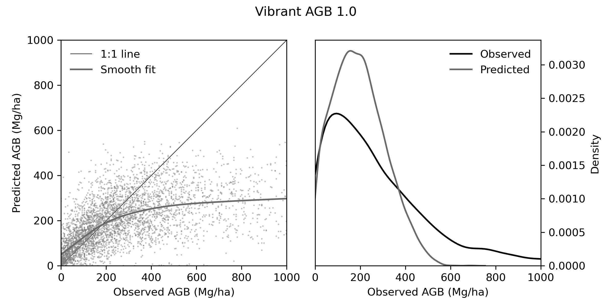

# VibrantAGB: Model Card[^1]
Jump to section:

- [Model details](#model-details)
- [Intended use](#intended-use)
- [Factors](#factors)
- [Metrics](#metrics)
- [Evaluation data](#evaluation-data)
- [Training data](#training-data)
- [Quantitative analyses](#quantitative-analyses)
- [Ethical considerations](#ethical-considerations)
- [Caveats and recommendations](#caveats-and-recommendations)
- [Acknowledgements](#acknowledgements)

## Model details
VibrantAGB is a regression model developed by Vibrant Planet to estimate the density of aboveground biomass (AGB, in units of Mg/ha) in live woody plants at 10-meter (10m) resolution from satellite imagery. The 10m raster resolution reflects a scale that follows recent scientific recommendations to represent tree biomass maps at no higher a resolution than "the crown diameter of a typical large tree, which ranges from about 10m for temperate forests to about 20m for tropical forests" [Duncanson et al. (2025).](https://doi.org/10.1126/science.adt6811)[^2] Inference is executed on overlapping 256x256 rasters which are subsequently mosaicked together to eliminate edge-stitching artifacts. 

### Contributors
Luke Zachmann, David Diaz, Tony Chang, Nathan Rutenbeck, Vincent Landau, Katharyn Duffy, Andreas Gros, Kiarie Ndegwa, Guy Bayes

### Model date
March 2025

### Model version
v1.0

### Model type
Feature Pyramid Network

## Intended use

### Primary intended uses
This model was designed to support forest mapping and monitoring with particular concern for the volume, biomass, and carbon stocking of trees, with direct applications in a decision support system for wildfire risk assessment and land management planning. It has been designed to produce estimates with an annual update frequency at sufficient resolution to enable planning and prioritization activities at spatial scales ranging from individual forest stands up to large landscapes. The model was developed with an initial geographic focus on the western United States following modeling approaches that can be readily extended to other forested regions. 

### Primary intended users
The intended direct users of VibrantAGB outputs are natural resource managers and professionals leading the development of wildfire risk assessments, community wildfire protection planning, and forest restoration plans through the [Vibrant Planet Platform](https://www.vibrantplanet.net/platform). These use cases generally involve access to zonal summaries of these rasters to the scale of management units rather than the underlying 10m resolution rasters. 

We also intended VibrantAGB rasters to be directly useful for project developers and verification bodies concerned with monitoring and reporting forest impacts on carbon stocks and stock changes attributable to forest restoration and wildfire mitigation programs, as well as the production of timber and other forest products. We anticipate these uses at moderate spatial resolution (e.g., individual parcels, management units) as well as coarser resolutions (e.g., county, provincial, or other jurisdictional scales, as well as watersheds and woodsheds).

### Out-of-scope use cases
Although we anticipate uses of VibrantAGB raster outputs by forest researchers and analysts in the public and private sectors for regional-scale analyses, we have not substantially altered model development based on these potential use cases.

Similarly, VibrantAGB was not intended for use in individual tree detection or attribution. The 10m resolution is intentionally selected for representing aboveground live biomass density on an areal basis as opposed to a per-tree basis.

## Factors
A key factor in the development of VibrantAGB involves utilization of imagery from the Sentinel-2 satellite constellation, and limitation of model inputs to features that can be extended globally in subsequent applications. The use of a seasonal composite from Sentinel-2 imagery limits the applicability of VibrantAGB back in time to 2018.  

We incorporate biogeographic factors into the preparation of training data and evaluation of model performance by fitting regionally-distinct allometric models employed in the preparation of training data and by evaluating model performance in each ecoregion.

We also incorporate the source of field plot data as a factor in performance evaluation (results not shown), quantifying model performance separately for each distinct natural resource agency and for distinct field campaigns within a single agency. For example, we evaluate model performance for each of several field campaigns conducted by the Bureau of Land Management in Oregon.

## Metrics
We evaluate model performance at both the plot-scale using individual forest inventory plots, as well at a regional scale using distributions of observations from National Forest Inventory data. In this model card, we present only the plot-level evaluation results.

### Plot-scale evaluation
We quantify plot-level performance using Mean Absolute Error (MAE), average bias, R-squared (R2) values. We also employ visual inspection of scatterplots of predicted vs. observed values to identify divergence from a 1:1 line over the range of observed biomass values, and through visual comparisons of distributions of observed and predicted datasets. We calculate these performance metrics globally using all available plots measurements that are precisely geolocated as well by each ecoregion and by agency and field campaign. 

During model training, we employ a weighted MAE loss function where pixel-wise loss is weighted according to the frequency of a pixel's biomass value compared to all biomass values across a batch of training tiles. This weighted loss is intended to prevent the model from ignoring uncommon but important biomass measurements near the tails of the distribution (particularly high biomass values), and attempts to ensure performance across the full range of biomass values rather than just the most common ones.

### Region-scale evaluation
We quantify region-scale predictive performance using Kolmogorov-Smirnov distance and Kullback-Leibler Divergence by comparing the distribution of pixel values generated by VibrantAGB with the distribution of FIA subplot values across the same region. 

These metrics are primarily used to compare the performance of VibrantAGB with other biomass models in each region (as opposed to evaluating VibrantAGB using these metrics in isolation). These evaluations are intended to determine which models best reproduce the full distribution of biomass observed in the field across a region. 

## Evaluation data
We employ field data for model validation that is independent from the data used to train the model:

* Remote sensing plots by state and federal agencies in the Pacific Northwest

### Datasets

*Remote sensing plots by agencies in northwest USA*

Forest plot data collected by the Bureau of Land Management (Oregon), US Forest Service (Oregon & Washington), and Washington DNR have been compiled through a combination of direct correspondence and public records requests from the respective agencies. The data acquired from these agencies includes raw field measurements including plot locations, as well as tree species, diameter, height, and live/dead status among several other attributes. The plot sizes and sampling protocols varied among the agencies, as did the dates of field data collection. In general, BLM and USFS conducted field campaigns to correspond with the collection of aerial lidar. Washington DNR collected field plot data to correspond with statewide NAIP imagery collected in 2021 that was processed using photogrammetry to generate point clouds. Most of these raw plot data have since been released as a [USDA Research Dataset by Fekety et al. (2020)](https://www.fs.usda.gov/rds/archive/catalog/RDS-2020-0026)[^3]. 

### Motivation
These datasets were chosen as the relatively few examples of forest field data that can be used as ground-truth. We have identified several other sources of plot- and stand-based measurements of forests and will continue to collect and ingest additional field measurements over time to improve the diversity and comprehensiveness of datasets available for model evaluation. 

### Preprocessing
Field measurements from remote sensing plots collected by BLM, USFS, and Washington DNR were grown forward on an annual timestep using the appropriate regional variant of the Forest Vegetation Simulator (FVS). We used FVS to generate estimates of canopy cover, dominant height, and aboveground live tree biomass (among many other attributes) from raw inventory data and each year forward in time from the year of collection to one or more years where these locations intersect with available lidar acquisitions and satellite imagery. Due to the lag between field measurement and the collection of remote sensing, we eliminated plots where a disturbance had been detected since the date of field measurement. We also eliminated plots where significant co-registration errors are believed to exist (based on strong divergence between field-measured tree heights and lidar-derived canopy height, for example).

The Washington DNR biomass raster was used without modification beyond retiling to our grid system. 

## Training data

### Features
We utilize two primary sources for features for VibrantAGB, both of which are derived from Sentinel-2 satellite imagery. We feed VibrantAGB embeddings produced by VibrantMAE, a geospatial foundation model trained as a Masked Auto-Encoder using Sentinel-2 imagery as well as a Sentinel-2 surface reflectance values summarized into a single June-July-August composite for each year. 

### Targets
We incorporate four primary datasets to develop targets for training the model: 

1. Pre-Training: eMapR biomass for pre-training VibrantAGB as an eMapR emulator
2. Training: FIA-derived allometric model applied to synthetic canopy height model
3. Training: Biomass layer produced by Washington Department of Natural Resources (DNR)
4. Training: Tiles with true zeros over non-vegetated surfaces

### eMapR biomass for pre-training
We utilize rasters produced by the Oregon State University (OSU) Environmental Monitoring, Analysis, and Process Recognition (eMapR) Lab for pre-training VibrantAGB. These rasters were accessed from a publicly-accessible FTP server hosted by OSU (and have confirmed licensing terms permitting our use in direct communication with the lead researcher). These eMapR data are rasters which depict estimates of aboveground live tree biomass at 30m resolution, and which were trained primarily on FIA plot data with unfuzzed (i.e., accurate) plot locations. The methods for producing these rasters nearest neighbor imputation based on timeseries of Landsat imagery smoothed using the Landtrendr algorithm along with bioclimatic variables. These methods are described in more detail in [Kennedy et al. (2018)](https://doi.org/10.1088/1748-9326/aa9d9e)[^4] and [Hudak et al. (2020)](https://doi.org/10.1088/1748-9326/ab93f9)[^5].

We trained an eMapR emulator using a partitioning of ~500,000 256x256 eMapR tiles limited to the Western USA from the year 2018 into 90% train and 10% test set. The model was trained to predict eMapR raster values based on Sentinel-2 embeddings from VibrantMAE and JJA composites for 45 epochs. 

### Allometric training tiles
To generate training tiles on higher-resolution and higher-fidelity data sources than eMapR, we developed an allometric model that relates field-measured tree heights and canopy cover to aboveground biomass at the scale of FIA subplots. We applied that allometric model to high-resolution lidar data to produce training tiles. 

#### USFS FIA for allometric modeling
We used data from FIA subplots to construct an allometric model predicting subplot-level biomass as a function of field-measured vertical canopy cover and maximum tree height. The development of this allometric model relied exclusively on publicly-available FIA data (i.e., without access to precise or unfuzzed FIA locations).

We limited the calculation of subplot-level biomass to trees that were observed within the 24-foot radius of each FIA subplot, excluding trees which were identified as being measured outside the boundary of the subplot (i.e., large trees on macroplots). In cases where a tree was large enough to be measured on a macroplot but for which no distance from plot center was recorded, we dropped the plot from the allometric model training dataset. The calculation of subplot-level canopy cover was based on a weighted average of the proportions of the subplot reported to fall into one or more "conditions" within which canopy cover is measured in the field following the FIA protocol. We calculated canopy height as the maximum height of trees observed within the subplot footprint.

#### Training tile production
We utilized estimates of canopy height produced by the [VibrantVS model](https://www.mdpi.com/2072-4292/17/6/1017)[^6] which was trained to generate synthetic canopy height models (CHM) from NAIP imagery. 

We passed a circular kernel the same size as an FIA subplot over the CHM, calculating canopy cover as the percentage of pixels within the kernel greater than zero (height above ground), and retrieving the maximum height within the kernel to represent maximum tree height. We applied the allometric model based on FIA subplots to estimate aboveground biomass for each pixel at very high resolution before resampling the biomass raster from 1m to 10m resolution for use in model training.

### Washington DNR 
Washington DNR produced a set of 20m resolution rasters of forest attributes across the state of Washington using a Random Forest model fit using gridded metrics derived from NAIP photogrammetry collected in 2021 along with bioclimatic features to predict forest attributes recorded on field plots measured across the state by DNR. We utilized the `BIOMASS_LIVE` layer. These layers may be accessed from the [State of Washington Geospatial Open Data Portal](https://geo.wa.gov/maps/wadnr::raster-all-rs-fris-rasters/).

### True zeroes over non-vegetated surfaces
To increase the number of examples of non-vegetated surfaces (e.g., water, ice), we incorporated training tiles that were entirely non-vegetated with the intention of enabling the model to be applied wall-to-wall across landscapes without requiring post-processing to remove out-of-distribution predictions over surfaces the model had little or no exposure to during training.

### Partitioning tiles for training, validation, and testing
We gridded all incoming data to a consistent grid system and assigned invidual grid cells to training, validation, or testing partitions with a 75/12.5/12.5% split, respectively. This ensures that data from different data sources or different years for the same tile are only seen in a single partition (e.g., overlapping Washington DNR and lidar allometric tiles are used only in training, testing or validation). 

We also ensure spatial segregation between training, validation, and testing partitions to limit the potential for "model leakage" due to spatial autocorrelation between tiles challenging the assumption of independence between tiles in each partition. We adopt a larger tiling grid with each grid cell spanning 50 kilometers. We limit tiles within these larger grid cells to a single partition (i.e., training, validation, or testing).

### Post-processing of model outputs
VibrantAGB outputs are generated initially as 256x256 rasters. Across an area of interest, we employ a mosaicking method to eliminate edge effects (e.g., seams at tile edges). We generate overlapping rasters where a single tile will be overlapped by four tiles centered at each corner of the original tile. The final raster value is calculated as a weighted average of the overlapping tiles using a Gaussian kernel with weights based on distance from tile center. This effectively upweights pixel values nearer the center of a tile and downeights pixel values nearer the edge of a tile and produces seamless mosaics. We report on model performance using these mosaicked outputs.

## Quantitative analyses
### Overall performance across all geographies and data sources

When considering global performance against all independent field plots, we observed strong corresopndence between field-observed and predicted biomass up through approximately 200 Mg/ha where the saturation pattern that is commonly observed from passive sensors of surface reflectance (contrasted with penetrating sensors such lidar or radar). While the model generates biomass estimates as high as 600 Mg/ha across the independent validation samples, it tends to substantially understimate biomass above 200 Mg/ha.

Overall the model showed an MAE of 137.7 Mg/ha, coefficient of variation (R2) of 0.17, and correlation coefficient (Pearson's R) of 0.53. When considering the 0-75th percentile of field-observed biomass range (up to 385 Mg/ha) the model performed with an MAE of 69.8 Mg/ha, coefficient of variation (R2) of 0.28, and correlation coefficient (Pearson's R) of 0.62. 

### Performance by region and data source
|Ecoregion          |n    |MAE    |R2  |Mean Bias | Pearson's R |
|-------------------|----:|------:|:-------------:|:--------:|:-----------:|
|Coast Range        |1,655|198.3 |-0.126|-141.6|0.357     |
|Cascades           |852  |130.0 |0.183 |-77.9 |0.571     |
|Eastern Cascades   |523  |56.8  |0.429 |-2.1  |0.656     |
|North Cascades     |425  |86.9  |0.48  |-27.2 |0.713     |
|Klamath Mountains  |253  |147.2 |0.032 |-118.7|0.596     |
|Blue Mountains     |205  |48.4  |0.5   |-4.9  |0.709     |
|Puget Lowland      |149  |104.8 |0.311 |2.8   |0.566     |
|Northern Rockies   |98   |63.3  |-0.076|42.3  |0.644     |
|Willamette Valley  |38   |141.5 |0.255 |-69.3 |0.608     |
|Columbia Plateau   |15   |36.9  |0.096 |11.2  |0.505     |

## Ethical considerations
The data used and generated by VibrantAGB are not considered sensitive nor to pose substantial risks to human health or safety. The data are intended to be instrumental in decision-making that may indirectly enable human health and safety to be better protected through more cost-effective and targeted wildfire and forest restoration planning. 

Increased availability and precision of data on the volume and potential value of forest products and other natural resources such as carbon storage and sequestration may contribute to land speculation. Information asymmetry may contribute to efforst by nefarious actors to capture land values from vulnerable populations with unclear tenure or access to capital necessary to realize these values themselves or protect them from other interested parties. 

Recognizing these potential risks, we are unaware of any use cases particular to this model that are especially fraught or likely to cause harm considering a variety of similar data sources at both high and moderate resolution are already produced by state and federal governments as well as by research groups and the private sector. 

We are also aware that carbon offset accounting and markets are contentious and that some market observers view these use cases as ethically dubious. We believe these disputes are largely related to the principles and practices of offset accounting and project development and financing, as opposed to the existence or quality of forest biomass maps. We believe that increasing quality of forest biomass maps will have overwhelmingly positive effects compared to the potential for negative impacts due to the use of these data by nefarious or unethical actors.

## Caveats and recommendations
VibrantAGB has been developed and evaluated with an initial focus on the Western USA. We caution against naive application of this model beyond that scope without additional effort to update the training and evaluation datasets to determine model performance in other regions. Similarly, due to the reliance on Sentinel-2 imagery, we have not investigated model performance going back prior to 2018 using coarser resolution data such as Harmonized Landsat and Sentinel imagery. In its current form, the model is not conditioned to generate smooth predictions over time. As such, application of the model in a time-series context may generate non-smooth trends that are problematic for direct estimation of carbon flux or stock change at very high resolution.

## Acknowledgements
This material is based upon work supported by the U.S. Department of Agriculture, under agreement number NR233A750004G042, and by the USDA Forest Service, under agreement number #24-CA-11132544-064. Any opinions, findings, conclusions, or recommendations expressed in this publication are those of the author(s) and do not necessarily reflect the views of the U.S. Department of Agriculture. In addition, any reference to specific brands or types of products or services does not constitute or imply an endorsement by the U.S. Department of Agriculture for those products or services.

[^1]: Sections and prompts from the [model cards paper](https://arxiv.org/abs/1810.03993), v2. This model card template was adapted from [Christian Garbin](https://github.com/fau-masters-collected-works-cgarbin/model-card-template)
[^2]: Recommendations for resolution limits for biomass maps from [Duncanson et al. (2025)](https://doi.org/10.1126/science.adt6811) citing crown diameters from [Jucker et al. (2022)](https://doi.org/10.1111/gcb.16302).
[^3]: Fekety, P.A. et al. (2020). Field observations for "A carbon monitoring system for mapping regional, annual aboveground biomass across the northwestern USA". Fort Collins, CO: Forest Service Research Data Archive. https://doi.org/10.2737/RDS-2020-0026
[^4]: Kennedy, R.E., et al. (2018). An empirical, integrated forest biomass monitoring system. Environ. Res. Lett. 13, 025004. https://doi.org/10.1088/1748-9326/aa9d9e
[^5]: Hudak, A.T. et al. (2020). A carbon monitoring system for mapping regional, annual aboveground biomass across the northwestern USA. Environ. Res. Lett. 15, 095003. https://doi.org/10.1088/1748-9326/ab93f9
[^6]: Chang, T., et al. (2025). VibrantVS: A High-Resolution Vision Transformer for Forest Canopy Height Estimation. Remote Sensing 17, 1017. https://doi.org/10.3390/rs17061017